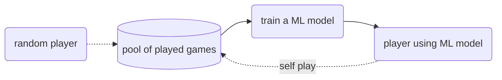
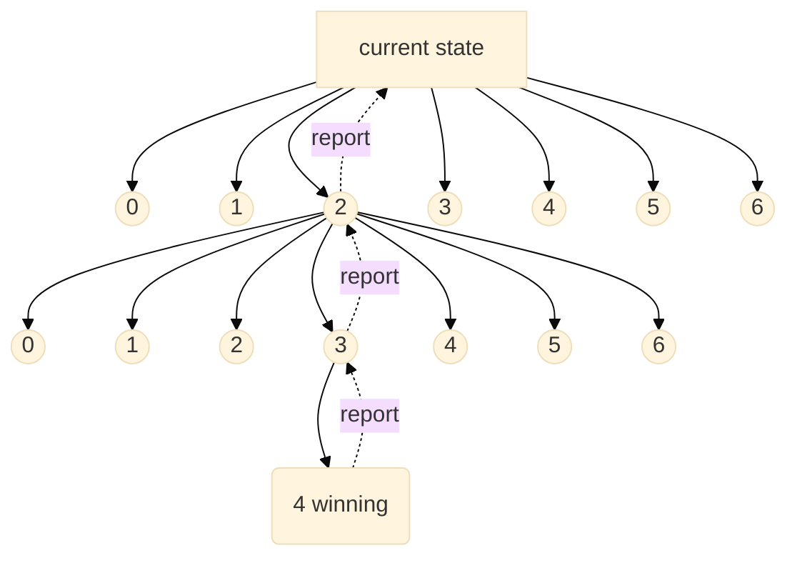
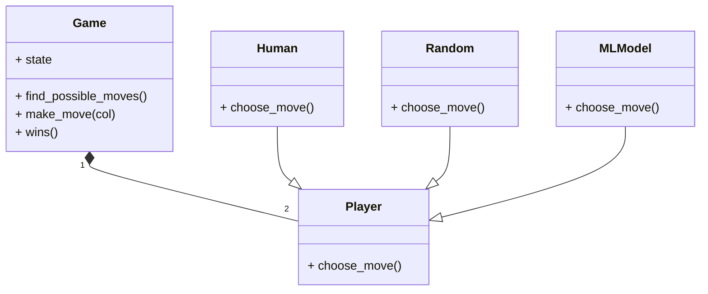
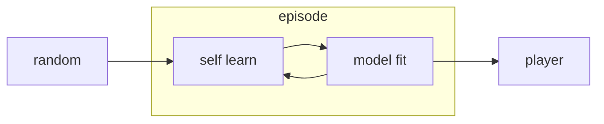

# Supervised learning

```mermaid
graph LR
id1[(pool of played games)]
id2(train a ML model)
id3(player using ML model)

id1-->id2-->id3
id3-.self play.->id1

id4(random player)
id4-.->id1
```

## Tree search

```mermaid
%%{init: {'securityLevel': 'loose', 'theme':'base'}}%%
graph TD
start[current state]
id0((0))
id1((1))
id2((2))
id3((3))
id4((4))
id5((5))
id6((6))
start --> id0
start --> id1
start --> id2
start --> id3
start --> id4
start --> id5
start --> id6
id20((0))
id21((1))
id22((2))
id23((3))
id24((4))
id25((5))
id26((6))
id2 --> id20
id2 --> id21
id2 --> id22
id2 --> id23
id2 --> id24
id2 --> id25
id2 --> id26
id234(4 winning)
id23 --> id234
id234  -.report.->id23
id23  -.report.->id2
id2  -.report.->start
```

## Environment

```mermaid
classDiagram
class Game{
+ state
+ find_possible_moves()
+ make_move(col)
+ wins()
}
class Player{
+ choose_move()
}
class Human{
+ choose_move()
}
class Random{
+ choose_move()
}
class MLModel{
+ choose_move()
}
Game "1" *-- "2" Player
Human --|> Player
Random --|> Player
MLModel --|> Player
```

```mermaid
flowchart LR
subgraph episode
	self[self learn]
	fit[model fit]
	self-->fit
	fit-->self
end
start[random]
start --> self
fit --> player

```

