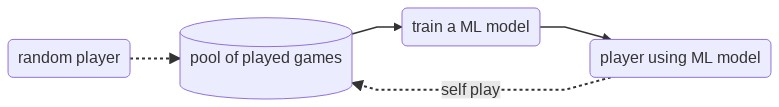
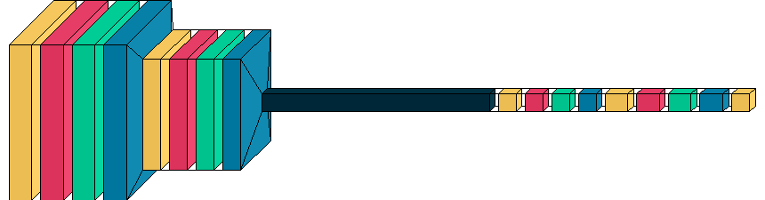

## Rules of the game

{ width=25% }&nbsp;&nbsp;&nbsp;&nbsp;&nbsp;&nbsp;&nbsp;&nbsp;&nbsp;&nbsp;&nbsp;&nbsp;
{ width=25% }

* Two players, 6 rows, 7 columns + gravity
* How to win: 4 pieces in a row in any direction
* Computer shall only learn from these rules!

## Environment 

* Game implements the rules
* Players will be ask to `choose_move`

## Supervised Learning (SL)

* SL needs labeled data
* Data generated by the computer playing
* Labels: *this state leads to A/B winning* $\rightarrow [+1,-1]$
* ML model returns score (i.e. 1 output)
* As a player, the model checks score of all possible moves and selects one
<!-- * Replay with improved model -->

## SL: Best Model

* `cc3d`: Input (6,7,2), output (1)
* Artificial neural network (Keras)
* Conv2d(256)$\rightarrow$Conv2d(128)$\rightarrow$Dense(128)$\rightarrow$Dense(256)$\rightarrow$Dense(1)$\rightarrow$tanh

 

## Reinforcement Learning (RL)

* Only a *reward* of the environment to an action
* Iterations to learn the environment
    * Exploration: evaluating policies (player and opponent)
    * Expoitation: fit ML / predict from ML 
* Model returns score (1) and policies (7)

## Evolution

The ANN learns to play better over several episodes

## Thanks to
- [A Simple Alpha(Go) Zero Tutorial](https://web.stanford.edu/~surag/posts/alphazero.html)  by Surag Nair
- [Mastering the game of Go without human knowledge](https://arxiv.org/abs/1712.01815) by D. Silver et al.
- ... and of course: Malte, Sara, Sam, Marija,

